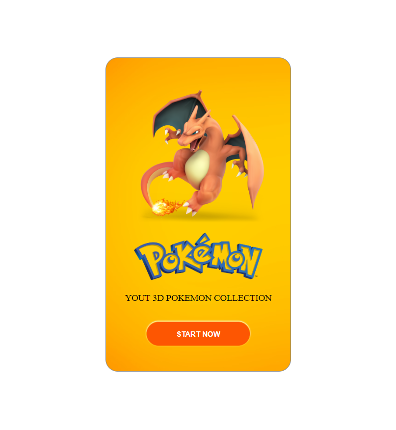

FRONTEND
===

## Information
- TITLE :  PORTIFOLIO FRONTEND
- AUTHOR :  LUIZ CARLOS
<!-- - Preprint: [https://arxiv.org/abs/xx]() -->
<!-- - Full-preprint: [paper position]() -->
<!-- - Video: [video position]() -->

## Images
<div float="left">
    
    
    
    
    
</div>

## Directory Hierarchy
```
|—— calendar
|    |—— css
|        |—— style.css
|    |—— index.html
|    |—— js
|        |—— script.js
|    |—— notes
|        |—— observation.txt
|—— editor-de-texto
|    |—— css
|        |—— editor.css
|        |—— icons.css
|    |—— font
|        |—— fontello.svg
|        |—— fontello.ttf
|    |—— index.html
|    |—— js
|        |—— editor.js
|        |—— jscolor.min.js
|    |—— README.md
|—— loading
|    |—— css
|        |—— style.css
|        |—— style.css.map
|        |—— style.scss
|    |—— index.html
|    |—— js
|—— pokemon
|    |—— css
|        |—— style.css
|    |—— img
|        |—— charizard.png
|        |—— logo.webp
|    |—— index.html
|    |—— README.md
```
